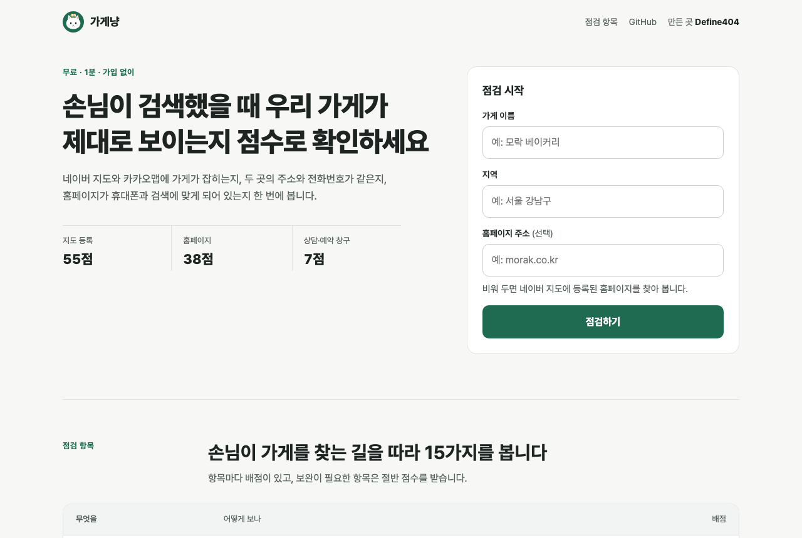

<p align="center"></p>

# 가게냥 (gage-meo)

[Define404]

바로 써 보기: https://gage.define404.com



우리 가게 온라인 점검: 손님이 검색했을 때 가게가 제대로 보이는지 100점 만점으로 확인하는 소상공인용 무료 도구

가게 이름과 지역만 넣으면 손님이 검색했을 때 가게가 제대로 보이는지 100점 만점으로 점검합니다. 네이버 지도와 카카오맵에 가게가 잡히는지, 두 곳의 이름·주소·전화번호가 같은지, 홈페이지가 휴대폰과 검색에 맞게 되어 있는지, 상담·예약 창구가 연결돼 있는지를 봅니다.

- 화면에서는 요약 점수와 항목별 결과를 보여 줍니다
- 항목마다 고치는 방법을 담은 상세 리포트는 메일로 보냅니다 (개인정보 수집 동의 필수, 광고성 정보 수신 동의 선택, 아래 "개인정보와 광고 수신")
- 대행사가 자기 이름·색·문의 주소로 배포할 수 있습니다
- 오픈소스(MIT)라 누구나 무료로 쓰고 고칠 수 있습니다

## 무엇을 보나 (v0.1, 15항목, 100점)

| 묶음 | 항목 | 배점 |
|---|---|---|
| 지도 등록 (55) | 네이버 지도에 등록 / 카카오맵에 등록 | 15 / 15 |
| | 두 지도의 가게 이름 일치 | 5 |
| | 두 지도의 주소 일치 (시도 표기, 괄호, 층·호수 차이는 걸러 냄) | 10 |
| | 두 지도의 전화번호 일치 (+82, 하이픈 정리, 0507 안심번호는 절반 점수) | 10 |
| 홈페이지 (38) | 홈페이지 연결, https, 휴대폰 화면 대응(viewport), 첫 응답 속도, 검색 제목·설명 | 각 5 |
| | 네이버 서치어드바이저 소유 확인 태그 (`naver-site-verification`) | 5 |
| | 사이트맵·robots.txt | 5 |
| | 카톡 공유 미리보기 (Open Graph) | 3 |
| 상담·예약 창구 (7) | 카카오톡 채널(`pf.kakao.com`) 또는 네이버 톡톡(`talk.naver.com`) 링크 | 5 |
| | 네이버 예약(`booking.naver.com`) 링크 | 2 |

- 좋음은 만점, 보완은 절반, 고칠 것과 확인 못 함은 0점입니다
- 홈페이지 주소를 비워 두면 네이버 검색 결과에 등록된 홈페이지를 씁니다
- 홈페이지가 없으면 홈페이지·창구 항목은 "확인 못 함"(0점)입니다. 점수 기준은 100점 그대로 둡니다
- 상담 창구가 없으면 리포트에 [부킹냥(booking-meo)](https://github.com/johndefine404/booking-meo)을 고치는 방법 중 하나로 안내합니다

## 구조

```
web/              입력·결과 화면 (정적 파일)
worker/
  src/index.ts    Hono 라우트: /api/config, /api/check, /api/lead, /api/unsubscribe
  src/places/     네이버·카카오 어댑터와 예시 데이터
  src/core/       정규화·비교, 홈페이지 점검, SSRF 방지 가져오기, 점수표
  src/lead/       D1 저장, 리포트 본문, 메일(Gmail API 또는 Resend), 광고 수신 규칙
  brand.json      브랜드 기본값
  migrations/     D1 테이블
  test/           단위 시험 (vitest)
```

## 설치

### 1. 준비물

- Cloudflare 무료 계정, Node.js 20 이상
- 네이버 검색 API 키, 카카오 로컬 API 키 (아래 3절). 없으면 지도 항목을 "확인 못 함(지도 확인 준비 중)"으로 두고 홈페이지·창구만 점검합니다
- (메일) Google Workspace 메일(Gmail API, 아래 4절) 또는 Resend 계정 중 하나

### 2. 배포

```bash
cd worker
npm install
npx wrangler login
npx wrangler d1 create gage-meo              # 나온 database_id 를 wrangler.toml 에 넣는다
npx wrangler d1 migrations apply DB --remote
npx wrangler secret put NAVER_CLIENT_ID
npx wrangler secret put NAVER_CLIENT_SECRET
npx wrangler secret put KAKAO_REST_KEY
npx wrangler secret put GMAIL_CLIENT_ID       # Gmail API 를 쓸 때 (4절)
npx wrangler secret put GMAIL_CLIENT_SECRET
npx wrangler secret put GMAIL_REFRESH_TOKEN
# 또는 npx wrangler secret put RESEND_API_KEY
npx wrangler secret put OWNER_EMAIL           # 새 신청 알림을 받을 메일
npx wrangler deploy
```

`wrangler.toml` 의 `MAIL_FROM` 은 보내는 주소로 바꿉니다 (Gmail 이면 그 Workspace 계정 주소, Resend 면 인증한 도메인 주소). `PRIVACY_URL` 에는 운영하는 쪽의 개인정보 처리방침 주소를 넣습니다. 동의 문구와 화면 아래에 링크로 걸립니다.

비밀값은 터미널에 찍히지 않게 표준 입력으로 넣습니다. 예: `cat client_id.txt | npx wrangler secret put GMAIL_CLIENT_ID`

### 3. API 키 받기

네이버 검색 API (지역 검색, 하루 25,000건)

2026년 7월 31일부터 새 키는 developers.naver.com 이 아니라 네이버 클라우드 플랫폼의 NAVER API HUB 에서 받습니다.

1. https://www.ncloud.com 에 가입하고 본인 인증, 결제 수단 등록을 마칩니다 (2026-10 기준 검색 API 는 무료)
2. 콘솔에서 NAVER API HUB > 이용 신청 후, Application 을 만들고 API 로 "NAVER 검색 > 지역"을 고릅니다
3. 인증 정보 탭의 Client ID 와 Client Secret 을 `NAVER_CLIENT_ID`, `NAVER_CLIENT_SECRET` 으로 넣습니다
4. 예전에 developers.naver.com 에서 받은 키가 있으면 그대로 넣고 `wrangler.toml` 의 `[vars]` 에 `NAVER_API_SOURCE = "openapi"` 를 추가합니다

카카오 로컬 API (키워드로 장소 검색)

1. https://developers.kakao.com 에 로그인하고 내 애플리케이션 > 애플리케이션 추가
2. 앱 설정 > 앱 키에서 REST API 키를 복사해 `KAKAO_REST_KEY` 로 넣습니다
3. 제품 설정에서 카카오맵(로컬) 사용 설정이 필요하면 켭니다
4. 문서: https://developers.kakao.com/docs/latest/ko/local/dev-guide#search-by-keyword

키가 없으면 그쪽 지도 항목은 "확인 못 함"으로 두고, 화면과 리포트에 "지도 확인은 준비 중"이라고 적습니다. 예시 데이터는 `MOCK=1` 일 때만 씁니다 (로컬 시험용).

### 4. 메일 보내는 길 고르기

비밀값에 따라 자동으로 고릅니다: `GMAIL_CLIENT_ID`, `GMAIL_CLIENT_SECRET`, `GMAIL_REFRESH_TOKEN` 셋이 다 있으면 Gmail API, 아니면 `RESEND_API_KEY` 가 있으면 Resend, 둘 다 없으면 보내지 않고 로그만 남깁니다.

Gmail API (Google Workspace 계정으로 보내기)

1. https://console.cloud.google.com 에서 프로젝트를 만들고 API 및 서비스 > 라이브러리에서 Gmail API 를 켭니다
2. OAuth 동의 화면을 내부(Internal, Workspace 전용)로 만들고 범위에 `https://www.googleapis.com/auth/gmail.send` 하나만 넣습니다
3. 사용자 인증 정보 > OAuth 클라이언트 ID 만들기에서 유형을 "데스크톱 앱"으로 고릅니다. 나온 클라이언트 ID 와 보안 비밀이 `GMAIL_CLIENT_ID`, `GMAIL_CLIENT_SECRET` 입니다
4. 보낼 계정으로 로그인한 채 `gmail.send` 범위로 승인을 한 번 받아 갱신 토큰(refresh token)을 얻습니다. 예: Google 의 OAuth 2.0 Playground(설정에서 자기 클라이언트 ID 사용)나 `google-auth-oauthlib` 의 `InstalledAppFlow` 로 승인하면 갱신 토큰이 나옵니다. 이것이 `GMAIL_REFRESH_TOKEN` 입니다
5. `MAIL_FROM` 은 `가게냥 <그 계정 주소>` 처럼 승인한 계정 주소로 적습니다. 다른 주소로 보내려면 Gmail 설정의 "다른 주소에서 메일 보내기"에 먼저 등록해야 합니다

서버는 갱신 토큰으로 접근 토큰을 받아 만료 전까지 메모리에 두고, 제목·보낸 이름을 UTF-8 로 인코딩한 MIME 메일(text/plain 과 text/html 두 부분, 수신 거부 머리글 포함)을 만들어 `users/me/messages/send` 로 보냅니다. 범위가 `gmail.send` 뿐이라 메일함을 읽을 수는 없습니다.

Resend: https://resend.com 에서 도메인을 인증하고 API 키를 `RESEND_API_KEY` 로 넣습니다.

## 대행사용 브랜드 설정

`worker/brand.json` 을 고치거나 `wrangler.toml` 의 `[vars]` 로 덮어씁니다. 환경 변수가 우선입니다.

| brand.json | 환경 변수 | 설명 |
|---|---|---|
| `name` | `BRAND_NAME` | 화면·메일에 나오는 회사 이름 |
| `url` | `BRAND_URL` | 회사 주소 |
| `color` | `BRAND_COLOR` | 대표 색 (`#RRGGBB`) |
| `ctaUrl` | `CTA_URL` | "고쳐 드립니다" 문의 주소 |
| `ctaLabel` | `CTA_LABEL` | 문의 상자 제목 |
| `privacyOwner` | `PRIVACY_OWNER` | 동의 문구에 나오는 개인정보 수집 주체 |
| `suggestBookingMeo` | `SUGGEST_BOOKING_MEO` | 상담 창구가 없을 때 부킹냥 안내 (`1`/`0`) |
| `privacyUrl` | `PRIVACY_URL` | 개인정보 처리방침 주소 (동의 문구, 화면 아래, 리포트 메일에 링크) |

## 개인정보와 광고 수신

법률 자문이 아니라 이 도구가 지키도록 만든 운영 기준입니다. 배포하는 쪽이 자기 상황에 맞는지 직접 확인해 주세요. 동의 문구는 `worker/src/brand.ts`, 광고 규칙은 `worker/src/lead/consent.ts` 에 있습니다.

| 무엇을 | 왜 | 얼마나 |
|---|---|---|
| 이메일 주소, 점검한 가게 이름·지역·점수 (필수 동의) | 상세 리포트 발송, 리포트 문의 응대 | 신청일부터 1년 뒤 매일 cron 이 지웁니다. 그 전에 메일 회신으로 삭제 요청 가능 |
| 홈페이지 주소를 포함한 점검 결과 | 리포트 메일을 만들 때 다시 읽기 | 7일 뒤 지웁니다 |
| 같은 이메일 주소로 광고 메일 (선택 동의) | 유료 서비스(대행) 안내 | 동의일부터 신청 기록을 지우는 1년까지, 거부하면 바로 멈춤 |

- 개인정보 보호법 제15조 제2항: 필수 동의와 광고 동의 문구 모두 목적, 항목, 보유·이용 기간, 동의 거부권과 거부 시 불이익을 적습니다
- 개인정보 보호법 제22조 제1항·제5항: 광고 동의는 따로 받는 선택 칸이고 처음에 체크돼 있지 않습니다. 동의하지 않아도 리포트는 똑같이 보냅니다. 필수 동의가 없으면 서버가 신청을 받지 않습니다 (400)
- 정보통신망법 제50조 제1항: 리포트 메일의 유료 서비스 안내(문의 링크)는 광고 동의자에게만 싣습니다. 동의하지 않은 사람의 메일에는 광고가 없습니다
- 제50조 제3항: 밤 9시부터 아침 8시(한국 시간)에는 따로 받은 동의가 없으므로, 그 시간에 신청하면 동의자에게도 광고를 빼고 보냅니다
- 제50조 제4항·시행령: 광고가 든 메일은 제목 앞에 (광고)를 붙이고, 본문 아래에 보낸 곳 이름, 연락처, 수신 거부 링크를 넣습니다
- 제50조 제2항·제5항·제6항: 수신 거부는 메일의 링크 한 번(`/api/unsubscribe`)으로 무료로 바로 처리되고, 같은 메일 주소의 모든 신청 기록에서 동의를 거둡니다. 메일 프로그램의 수신 거부 버튼(List-Unsubscribe)도 같이 겁니다
- 제50조 제7항: 동의하거나 동의하지 않은 결과는 리포트 메일 아래에, 수신 거부 결과는 따로 짧은 메일로 알립니다 (메일 키가 없으면 로그에 남깁니다)
- 제50조 제8항 (2년마다 재확인): 신청 기록을 1년 뒤 지우므로 동의가 2년을 넘기지 않습니다. 보관 기간을 늘려도 안전하도록 2년 지난 동의는 코드에서 무효로 봅니다
- 처리 위탁과 국외 이전: 동의 문구의 "내용 보기"에 서버 운영·저장(Cloudflare, Inc., 미국)과 메일 발송(Google LLC, 미국) 위탁을 적고 개인정보 처리방침으로 연결합니다. 다른 업체를 쓰면 `worker/src/brand.ts` 의 문구와 버전을 바꿉니다
- 동의 시각과 동의 문구 버전(`CONSENT_VERSION`)을 같이 저장합니다. 문구를 바꾸면 버전을 올립니다
- 이 도구는 리포트 메일 말고는 광고 메일을 자동으로 보내지 않습니다. 운영자가 신청 기록으로 따로 광고를 보낼 때는 `consent_marketing = 1` 인 주소에만, 낮 시간에, 위 표기를 지켜 보내야 합니다
- 메일 회신이 운영자에게 닿도록 `OWNER_EMAIL` 을 꼭 넣어 주세요 (리포트 메일의 회신 주소가 됩니다)
- 같은 점검에 같은 메일로 다시 신청하면 메일을 다시 보내지 않습니다
- 보호 장치: 접속자당 1분 10회, 하루 점검 상한(`DAILY_CHECK_LIMIT`), 하루 리포트 상한(`DAILY_LEAD_LIMIT`), 봇용 숨은 칸

## 사용자가 넣은 주소를 여는 방식 (SSRF 방지)

서버가 홈페이지를 대신 열기 때문에 내부망을 엿보는 데 쓰이지 않게 막습니다.

- http, https 만, 기본 포트(80, 443)만, 아이디·비밀번호가 들어간 주소는 거절
- `localhost`, `.local` 같은 내부 이름과 사설·루프백·링크로컬·예약 IP(IPv4, IPv6, IPv4 매핑 표기 포함)는 거절
- 도메인은 DNS-over-HTTPS(Cloudflare)로 풀어서 나온 IP가 하나라도 내부망이면 거절
- 리다이렉트는 직접 따라가며 최대 3번, 매번 같은 검사를 다시 합니다
- 요청당 8초 제한, 페이지는 1.5MB까지만 읽습니다

남은 한계: DNS 확인과 실제 연결 사이에 주소가 바뀌는 공격(DNS 리바인딩)은 이 방식으로 완전히 막지 못합니다. Cloudflare Workers 에서 돌리면 요청이 Cloudflare 망에서 나가므로 운영자 내부망에는 닿지 않지만, 다른 환경에 옮길 때는 이 점을 따로 막아야 합니다.

## 다른 사이트에서 보낸 쓰기 요청 막기

- 쓰기 요청(POST·PUT·PATCH·DELETE)은 `Origin` 이 이 사이트 주소일 때만 받습니다. 다른 출처면 아무것도 저장하지 않고 403 을 돌려줍니다. `text/plain` 같은 단순 POST 도 같습니다.
- `Origin` 이 `null` 이면 `Sec-Fetch-Site: same-origin` 일 때만 받습니다. `Origin` 이 없으면 `Sec-Fetch-Site: cross-site` 만 막고, 머리글이 없는 서버·메일 프로그램 요청은 받습니다.
- `/api/check`, `/api/lead` 는 `Content-Type: application/json` 이 아니면 415 입니다.
- 메일 프로그램의 원클릭 수신 거부(`POST /api/unsubscribe`, RFC 8058)는 폼 형식 그대로 받습니다.
- 다른 출처를 더 받으려면 `ALLOWED_ORIGINS` 에 쉼표로 적습니다. `MOCK=1` 시험 모드에서는 `http://localhost` 도 받습니다.

## 로컬에서 시험하기

```bash
cd worker
npm install
npx wrangler types
cp .dev.vars.example .dev.vars
npm run db:local                 # 로컬 D1 테이블 만들기
npm run dev:mock                 # 지도 API 호출 없이 예시 데이터로
npm test                         # 단위 시험
```

`http://localhost:8787/` 을 엽니다. 예시 데이터는 입력한 이름·지역으로 가상의 가게를 만듭니다. 이름에 "없는"을 넣으면 두 지도 모두 검색되지 않고, "카카오만"을 넣으면 네이버에서만 빠집니다. 메일 키가 없으면 리포트와 알림 내용을 터미널 로그에 찍습니다.

## 확인한 것과 아직 확인하지 않은 것

- 확인함: 정규화·비교·점수표·SSRF 검사·동의 문구·광고 수신 규칙 단위 시험, `wrangler dev` 예시 모드에서 수신 거부 링크와 처리 결과 알림(로그), 로컬 시험 서버로 홈페이지 점검, `wrangler dev` 예시 모드에서 점검과 리포트 신청 흐름, 실제 공개 사이트 홈페이지 점검
- 확인함 (2026-10-09, `wrangler dev`): Gmail API 로 리포트 메일과 운영자 알림 실제 발송, 필수 동의 없는 신청 거절(400), 키가 없을 때 지도 항목 "준비 중" 표시, MIME 만들기 단위 시험
- 확인하지 않음: 네이버·카카오 실제 API 호출 (키 발급 전, 응답 모양은 공식 문서 기준), Resend 실제 발송, 운영 배포와 cron 실행
- 홈페이지는 서버가 내려준 HTML 만 읽습니다. 자바스크립트로 나중에 그려지는 링크·태그는 보지 못합니다
- 네이버 지역 검색은 전화번호를 비워서 주는 경우가 많습니다. 이때 전화번호 일치는 "보완"으로 나옵니다

## 만든 곳

[Define404](https://contact.define404.com) · JohnLKim

지도 정보 정리, 홈페이지 수정, 상담 창구 연결은 Define404에 문의해 주세요.

---

## English

gage-meo ("가게냥", shop cat) scores a Korean small business's online presence (0 to 100) from its name and region. It searches Naver Local Search and Kakao Local (behind adapters; realistic mock data only with `MOCK=1`, and without keys the map items are reported as "pending" instead of faked), compares name, address and phone across the two after normalization, and checks the homepage for https, viewport, response time, title/description, Naver Search Advisor verification, sitemap/robots, Open Graph, and KakaoTalk channel, Naver TalkTalk and Naver Booking links. User-supplied URLs are fetched through an SSRF guard (http/https only, default ports, private IPs blocked after DNS-over-HTTPS resolution, max 3 re-validated redirects, timeout and size limit). The summary is shown on screen; the detailed report with fixes is emailed after required privacy consent. Optional marketing consent is stored separately: the paid-service CTA is included only for consenting recipients and only between 08:00 and 21:00 KST, with a "(광고)" subject prefix, sender contact and a one-click unsubscribe link (consent results are notified by email, consent older than 2 years is treated as void). Leads go to D1, and mail goes out through the Gmail API (Google Workspace, `gmail.send` scope only, multipart MIME built in the Worker) or Resend. Brand name, color and CTA are configurable for agencies. Runs on Cloudflare Workers (Hono) + D1. Real Naver/Kakao API calls are untested. MIT licensed.
